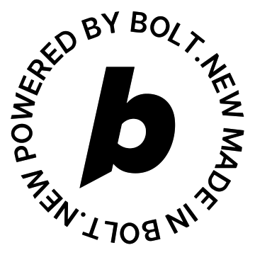

# 🧠 MindPal - AI Mental Health Companion

<div align="center">
  
  
  **Your intelligent companion for mental wellness, memory support, and emotional well-being**
  
  [](https://bolt.new)
  [](https://reactjs.org/)
  [](https://www.typescriptlang.org/)
  [](https://supabase.com/)
  [](https://tailwindcss.com/)
</div>

---

## ✨ Features

### 🎯 **Core Functionality**
- **🗣️ Voice AI Conversations** - Natural voice interactions with AI companion using ElevenLabs
- **📹 Video Consultations** - Face-to-face AI therapy sessions powered by Tavus
- **📝 Task Management** - ADHD-friendly task organization with smart reminders
- **💭 Mood Tracking** - Daily emotional wellness monitoring with streak tracking
- **📊 AI-Powered Reports** - Comprehensive session analysis and mental health insights

### 🔒 **Privacy & Security**
- **End-to-End Encryption** - Sensitive data protected with Web Crypto API
- **Private Conversations** - Voice chats are temporary and not stored
- **Secure Authentication** - Supabase Auth with JWT tokens
- **Data Ownership** - Users control their data with export capabilities

### 🌟 **Advanced Features**
- **Multi-Language Support** - 12+ languages with real-time translation
- **Customizable AI Personality** - Supportive, Professional, Friendly, or Motivational
- **Dark/Light Theme** - Adaptive UI with system preference detection
- **Offline Resilience** - Graceful degradation when connectivity is limited
- **Real-time Sync** - Live updates across devices

### 🎨 **User Experience**
- **Beautiful Animations** - Smooth Framer Motion transitions
- **Responsive Design** - Mobile-first approach with desktop optimization
- **Accessibility** - WCAG compliant with keyboard navigation
- **Progressive Web App** - Install on any device for native-like experience

---

## 🛠️ Tech Stack

### **Frontend Framework**
- **React 18.3.1** - Modern React with hooks and concurrent features
- **TypeScript 5.5.3** - Type-safe development with enhanced DX
- **Vite 5.4.2** - Lightning-fast build tool and dev server

### **Styling & UI**
- **Tailwind CSS 3.4.1** - Utility-first CSS framework
- **Framer Motion 10.16.16** - Production-ready motion library
- **Lucide React 0.344.0** - Beautiful, customizable icons
- **React Hot Toast 2.4.1** - Elegant notification system

### **Backend & Database**
- **Supabase** - PostgreSQL database with real-time subscriptions
- **Row Level Security (RLS)** - Database-level security policies
- **Edge Functions** - Serverless functions for API integrations
- **Real-time Subscriptions** - Live data updates

### **AI & Voice Services**
- **ElevenLabs API** - High-quality text-to-speech synthesis
- **Tavus API** - AI-powered video conversations
- **Gemini AI** - Advanced language model for conversations
- **Web Speech API** - Browser-native speech recognition

### **Authentication & Security**
- **Supabase Auth** - Secure user authentication with JWT
- **Web Crypto API** - Client-side encryption for sensitive data
- **PKCE Flow** - Secure OAuth implementation
- **Session Management** - Automatic token refresh and validation

### **Development Tools**
- **ESLint** - Code linting with TypeScript support
- **PostCSS** - CSS processing with Autoprefixer
- **React Router DOM** - Client-side routing
- **Date-fns** - Modern date utility library

---

## 🚀 Quick Start

### Prerequisites
- Node.js 18+ 
- npm or yarn
- Supabase account
- API keys for AI services (optional)

### Installation

1. **Clone the repository**
   ```bash
   git clone <repository-url>
   cd mindpal-ai-companion
   ```

2. **Install dependencies**
   ```bash
   npm install
   ```

3. **Environment Setup**
   ```bash
   cp .env.example .env
   ```
   
   Configure your environment variables:
   ```env
   # Required - Supabase Configuration
   VITE_SUPABASE_URL=your_supabase_url
   VITE_SUPABASE_ANON_KEY=your_supabase_anon_key
   
   # Optional - AI Services
   VITE_ELEVENLABS_API_KEY=your_elevenlabs_key
   VITE_TAVUS_API_KEY=your_tavus_key
   VITE_GEMINI_API_KEY=your_gemini_key
   ```

4. **Database Setup**
   ```bash
   # Run Supabase migrations
   npx supabase db push
   ```

5. **Start Development Server**
   ```bash
   npm run dev
   ```

6. **Open in Browser**
   Navigate to `http://localhost:5173`

---

## 📁 Project Structure

```
mindpal-ai-companion/
├── src/
│   ├── components/          # React components
│   │   ├── auth/           # Authentication components
│   │   ├── dashboard/      # Dashboard and overview
│   │   ├── mood/           # Mood tracking features
│   │   ├── tasks/          # Task management
│   │   ├── voice/          # Voice AI interface
│   │   ├── video/          # Video consultation
│   │   ├── settings/       # User preferences
│   │   └── reports/        # Session reports
│   ├── hooks/              # Custom React hooks
│   │   ├── useAuth.ts      # Authentication logic
│   │   ├── useVoice.ts     # Voice AI integration
│   │   ├── useTavusVideo.ts # Video session management
│   │   ├── useSettings.ts  # User preferences
│   │   └── useNetworkStatus.ts # Connectivity monitoring
│   ├── lib/                # Utility libraries
│   │   └── supabase.ts     # Database configuration
│   ├── types/              # TypeScript definitions
│   └── main.tsx           # Application entry point
├── supabase/
│   └── migrations/         # Database schema migrations
├── public/                 # Static assets
└── docs/                  # Documentation
```

---

## 🔧 Configuration

### **Supabase Setup**
1. Create a new Supabase project
2. Run the provided migrations to set up the database schema
3. Configure Row Level Security policies
4. Add your Supabase URL and anon key to `.env`

### **AI Services (Optional)**
- **ElevenLabs**: For high-quality voice synthesis
- **Tavus**: For AI video conversations  
- **Gemini**: For advanced AI conversations
- **Lingo**: For multi-language translation

### **Authentication**
- Email/password authentication enabled by default
- Email confirmation disabled for development
- JWT tokens with automatic refresh
- Secure session management

---

## 🌐 Deployment

### **Netlify (Recommended)**
```bash
# Build for production
npm run build

# Deploy to Netlify
# The _redirects file is included for SPA routing
```

### **Environment Variables for Production**
Ensure all required environment variables are set in your deployment platform:
- `VITE_SUPABASE_URL`
- `VITE_SUPABASE_ANON_KEY`
- Optional AI service keys

---

## 🔐 Security Features

### **Data Protection**
- Client-side encryption for sensitive data
- Secure API key management
- No storage of voice recordings by default
- GDPR-compliant data handling

### **Authentication Security**
- JWT token validation
- Automatic session refresh
- Secure logout with token cleanup
- Protection against common attacks

### **Database Security**
- Row Level Security (RLS) enabled
- User-specific data access policies
- Encrypted connections
- Audit logging

---

## 🎯 Key Features Deep Dive

### **Voice AI Companion**
- Natural conversation flow with context awareness
- Multiple AI personalities (Supportive, Professional, Friendly, Motivational)
- Real-time speech recognition and synthesis
- Conversation privacy (not stored permanently)

### **Video Consultations**
- AI-powered face-to-face therapy sessions
- Session analytics and reporting
- Automatic session management
- Technical performance monitoring

### **Mood Tracking**
- Daily mood logging with emoji selection
- Streak tracking with motivational milestones
- Historical mood analysis
- Integration with AI conversations

### **Task Management**
- ADHD-friendly design principles
- Priority-based organization
- Due date tracking with visual indicators
- Category-based filtering

---

## 🤝 Contributing

We welcome contributions! Please see our contributing guidelines:

1. Fork the repository
2. Create a feature branch
3. Make your changes with proper TypeScript types
4. Add tests if applicable
5. Submit a pull request

### **Development Guidelines**
- Follow the existing code style
- Use TypeScript for all new code
- Implement proper error handling
- Add JSDoc comments for complex functions
- Ensure responsive design

---

## 📄 License

This project is licensed under the MIT License - see the [LICENSE](LICENSE) file for details.

---

## 🙏 Acknowledgments

- **Bolt.new** - For the amazing development platform
- **Supabase** - For the robust backend infrastructure
- **ElevenLabs** - For high-quality voice synthesis
- **Tavus** - For AI video conversation technology
- **React Team** - For the excellent frontend framework
- **Tailwind CSS** - For the utility-first CSS framework

---

## 📞 Support

For support, please:
1. Check the documentation
2. Search existing issues
3. Create a new issue with detailed information
4. Join our community discussions

---

<div align="center">
  <p><strong>Built with ❤️ for mental wellness and AI innovation</strong></p>
  <p>
    <a href="https://bolt.new">Built on Bolt</a> •
    <a href="#features">Features</a> •
    <a href="#tech-stack">Tech Stack</a> •
    <a href="#quick-start">Quick Start</a>
  </p>
</div>